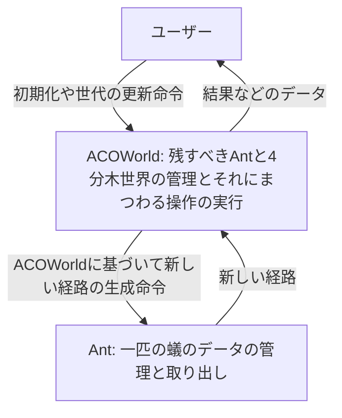
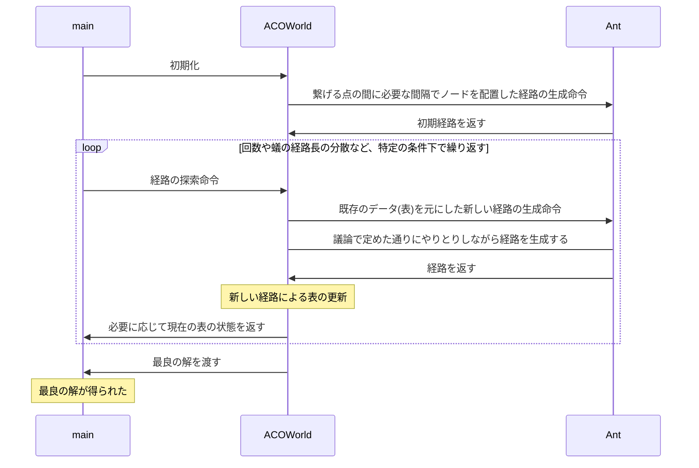
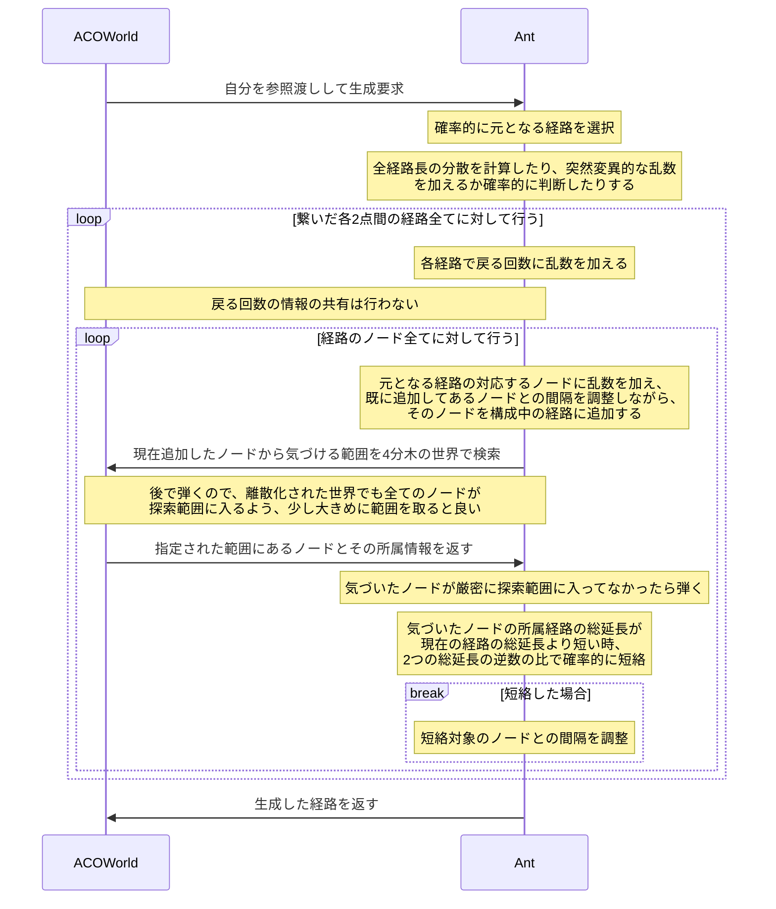
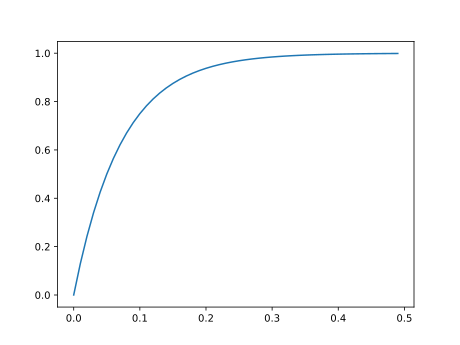

# 設計

## 要求仕様

### 大雑把

Antが行うべきは基本的にデータの管理と取り出しであるが、新しい経路の生成は一匹の蟻のデータを精密に操作する段階であると同時に、ある意味で蟻が探索する過程とも言えるので、その作業はAntに任せるものとした。

### 構造化分析

`main`において、ループにグローバル変数を噛ませて、`Ctrl+C`で中断できるようにしても良いかも知れない。また、CSVから読み込めるようにして、途中から再開できるようにしても良いだろう。

また、新しい経路の生成過程は以下の通り。[効率的な収束方法](#効率的な収束方法)で述べた通り、ノードの間隔はいきなり`main`から与えられたものになるのではなく、疎の状態から徐々に高めていく。

## 議論

### 結論

| 議論の種                                     | 結論                                                         | 他の候補                                                     |
| -------------------------------------------- | ------------------------------------------------------------ | ------------------------------------------------------------ |
| 経路の表し方                                 | 座標を束ねた行列                                             | 角度のベクトル                                               |
| 経路間隔の調整                               | 経路を生成するときに閾値を元にノードを間に補完したり、削除する |                                                              |
| 経路の共有方法                               | 戻らせる                                                     | 後ろに進ませる                                               |
| フェロモンの保存方法                         | 優れたものの表と、離散化した世界へのノードの配置(つまり両方使う) | 実際に配置する, 優れたものの表                               |
| 経路の生成方法                               | PB-ACOと乱数と離散化した世界                                 | PB-ACOと乱数, ACO~R~と窓関数                                 |
| 経路の収束方法                               | 経路長の分散とGA                                             |                                                              |
| 範囲内に存在するノードの検索方法             | 4分木アルゴリズム                                            | 辞書型                                                       |
| 元にする経路の選択と新しく生成する経路の個数 | ACOに基づき、経路長の逆数の確率比に基づいて、1つずつ生成する | GAに基づいたルーレット形式, 1度に複数の経路生成              |
| 経路を短絡した後に乱数を加えるべきか         | 取り敢えず加えない                                           | 加える                                                       |
| ~~戻る回数を変更したときの動作~~             | 差し当たって放置。現状の仕様で作ってみて問題があったら考える。 |                                                              |
| フェロモンの蒸発と経路の削除方法             | ACO~R~を元に、蒸発を考慮しつつ最悪削除する                   | FIFO, 蒸発を考慮しながら閾値以下のものを削除                 |
| 経路の効率的な収束方法                       | 大域的且つ弓状に近隣ノードにも乱数を加える                   | 最初から与えられた密度, 徐々にノード密度を高める, 近隣の乱数も加える |

### 角度による経路と座標による経路: 座標の勝利

1度に蟻が進める距離を定数として決め、角度のベクトルを定めさせることによっても、蟻の経路を求められる。しかし、これでは経路途中の角度を変えた途端、その後ろの経路が劇的な影響を受けてしまうため、最適化させづらい。

これに対し、経路を座標として表わせば、途中のノード位置を変えても、その後ろの経路は影響を受けない。従って、経路は座標で表わした方が良い。

但し、この方式にはノード間の間隔調整問題がある。ノードが偶発的に特定の箇所に密集してしまうと、ノード密度の薄い箇所は本当に最適化されているのか疑問視せざるを得ない為である。

#### 接合点による管理

もう一つ追加の方法として、接合点を中心に考える方法がある。フェルマー点を用いても良いし、楕円を用いて徐々に点同士を繋いでいっても良い。フェルマー点については余り考えていないが、楕円についてはある程度考えてある。隣り合う2つの接合点を焦点とした楕円を置き、更にそれらの楕円の周を焦点とする楕円の通る領域の外周を置き、更にそれらを焦点とする...といったイメージである。

しかし、この方法だと直線を前提にしているので、費用関数の拡張が効かない。

### 経路間隔の調整方法

方式1は収束方法に表面張力の考え方を利用しているので速く収束するかも知れないが、代わりにその場所に経路を設けるコストを設定するなどの拡張が効かない欠点がある。取り敢えずは**方式2**を採用したい。

#### 方式1: 隣り合うノードへのベクトルに沿わせる

元々このプロジェクトは水の表面張力のようにACOが最適化できるのではないか、というアイデアに基づいている。あれは、互いが同じ程度の力で引っ張り合うために出来る現象だろう。従って、1つのベクトルが位置調整をするとき、隣り合うノードへのベクトルの合力を求め、それに乱数**何の?**を掛け合わせることで、上手く密集させないようにさせながら、間隔を調整させられるのではないだろうか。

#### 方式2: 経路を生成するときに閾値を元にノードを間に補完したり、削除する

方式1は収束方法に表面張力の考え方を利用しているので速く収束するかも知れないが、代わりにその場所に経路を設けるコストを設定するなどの拡張が効かない欠点がある。これに対し、こちらでは収束原理はACOだけなので、拡張が効く。今回のアルゴリズムはACOと分子の動きを摺り合わせるようにして作りたいが、ACOの汎用性を損なってはならない。

間にノードを新設する場合は対象のノードへのベクトルを$k\in(0,1)$倍した箇所に作れば良いし、削除する場合は削除対象のノードとの重心を取れば良い。隣り合う複数のノードを削除する場合は、一番最初のノードが、自分の重みを減らしながら1つずつ次のノードを食べていく、自分と次のノードとの加重平均を取れば良い。最終的には削除した全てのノードの重心にしたい。

### 戻るか、後ろに進ませるか

シュタイナー木では、目的として繋げたいノード間の経路同士は、一部共有されることが多いので、それらの経路をどのようにして共有させるかの議論が必要である。

#### 戻る

少なくとも、隣り合うノードへのベクトルの合力に沿わせて経路を調整させる限り、戻る方式の方が優れている。これは、共有点の終わりのノードの位置を上手く調整させるためである。ここで後ろに進ませる方式を採ってしまうと、隣り合うノードを3つ持っているはずのそのノードは、2つのノードしか隣り合っていないと認識してしまうため、経路調整をしている内に寧ろ共有していたはずの経路が剥離してしまう可能性さえある。

#### 後ろに進ませる

### フェロモンの保存方法

#### 実際に配置していく

ノードとは別に、配列で世界を作り、離散的に保存する方法と、ノードを元に関数で管理する2つの方法がある。

後者に関しては、蒸発度と座標を保存したタプルを`deque`に詰め、その`deque`の要素と与えられた座標から、その場におけるフェロモンを導出できる。先に入ったものから先に蒸発する点を利用している。

これらの方式では、前者では世界が平滑化されてしまうし、後者ではノードの数だけの計算量が掛かる問題がある。更に、共通する問題として、2つのノード間にフェロモンを配置するのが難しい、ということがあるだろう。

#### 優れたものの表

PB-ACOの真似である。GAにも似ている。この方式なら、世界に対してフェロモンを保存する必要がなく、計算が速くなると言えるだろう。但し、経路共有を後ろに進ませる方式でやってしまうとこの形式は取れない。

### 新しい経路の生成方法: 優れたものの表形式において

#### PB-ACOと正規分布

この方式では劣った経路を表から排斥することで最適な経路を見つけようとするが、その時の新しい経路の生成方法には、GAのルーレット形式のような勾配のある確率分布から経路を選び、そこに正規分布から生成した乱数を加えていくのが良いと考えられる。これは、ACOの経路選択にも似ているだろう。問題は、1つを生成するか、1度に一定の量を生成するかである。

ACO~R~ではPB-ACOよりもパラメーター間の関係を重視していないと感じたのでPB-ACO形式を採用した。今回の問題ではノードとノードの関係が目的関数に直結している。ACO~R~ではそれぞれのパラメーターに独立に確率密度関数を与えるので、確率次第で近くに存在していたはずの2つのノードが遠くに離れてしまう、ということがありうる。

しかしながら、この方式には2つの経路が交わっていても、その情報を交換できない欠点がある。現実の蟻ならば交差点でより短い方のフェロモンに気づけるが、この方式では気づけない。解決方法としては、行列で量子化した世界にフェロモンではなくノードを配置し、許容される範囲内にある全てのノードから進める経路長と自分がこれから行く経路長を比較し、それらの最短を行く方法がある。

~~但し、今回の問題はシュタイナー木なので、単純に短い方に気づいても意味が無いことはある。例えば、正方形でシュタイナー木を求めさせたとき、最適解は2つあるが、一方の最適解を通っていた蟻がそれらの交差点で他方の最適解に移ってしまえば、それは最適解ではなくなってしまう。尤も、そのような例は単に排斥されると考えられる。~~

2つの接続するべきノードの組合せ毎にフェロモンのノードを量子化した世界に保存し、それらを探索することで、解を混同せずに経路間で情報を交換できる。但し、計算量は幾らか悪化する。それでも、経路間で情報が交換されない場合に比べれば、解を求める速度は速まるかも知れない。

この方式がフェロモンを実際に保存する方法と若干違う点は、経路の更新はあくまで表で行う、ということである。フェロモンを行列の値として保存すると平滑化の弊害が考えられるが、この方式なら経路毎にフェロモンの濃度を把握しつつも、実際の蟻がその「より短い他の経路」に気づけるかどうかの問題(今まではそのノード遠すぎない?問題があった。)も考慮することが出来る。更に、全く新しい経路の生成方法も、表形式のフェロモン更新方法が本来持っている、乱数を加算する方式で解決している。その上、ACO~R~と窓関数形式の持つ欠点も、この方式なら存在しない。

具体的なアルゴリズムは以下の通り。

1. `vector<vector<set<array<double,3>>>`にノードの座標と、そのノードを使った経路の評価関数の値を保存する
2. 参照すべき範囲のノードを必要十分に参照する([方法は別途考える](#範囲内に存在するノードの検索方法: 4分木アルゴリズム))
3. 新しくそのノードを使った経路を保存するときは新しいノードとして保存する
4. 経路を消去するときはフェロモンの表に保存されている座標からノードの保存場所を辿って消していく

#### ACO~R~と窓関数

上述の通り、ACO~R~では遠くのノードにも移動してしまう可能性がある。そこで採用されるのが窓関数である。ACO~R~の確率密度関数に、移動先のノードを中心にするのか、移動前のノードを中心とするのかは別として、確率密度関数に窓関数を掛けてやれば、遠くのノードへ移動してしまうことを防止できる。

この方式であれば、上の方式よりもフェロモンの実情を反映しやすいのではないだろうか。

但し、この方式には同じ区間では、異なる経路であってもそれを構成するノード数が等しくなければならない制限があるため、単純にこの方式を採用することは難しい。

### 経路の収束方法

上において、新しい経路は既存の経路に正規分布の乱数を加えて生成すると述べたが、それだけでは何時まで経っても解は収束しない。ここでは、より詳細に新しい解の生成方法について議論する。

結論としては、正規分布の乱数には全ての経路長の分散を掛けることで収束を促しつつ、局所解を避けるためにGAの突然変異的な乱数も加えることが望ましいと考えられる。

### 範囲内に存在するノードの検索方法: 4分木アルゴリズム

ここでは、1つの量子化単位に保存されている、許された範囲のノードを参照する方法について議論する。

どうなっても蟻の数は超えないので、全部やっても良いかもしれないが、余り嬉しくない。結論としては、4分木アルゴリズムを使うのが良いと考えられる。過去には世界を行列のように区分した上で保存し、検索するときに近場の要素から確認する方法が有力視されていたが、この方式は空間計算量的に無駄が多い。4分木アルゴリズムならより細かく世界を区切ることも可能だろう。

また、過去には蟻の気づける範囲を円形にしようとしたことがあったが、高速化のために**探査範囲は矩形**にするのが良いだろう。画像処理フィルターだって、自然界なら円だろうに、計算機なら矩形である。どうしても探査範囲を円にしたいのなら、**矩形で抽出した後で弾けば良い**。元々矩形が探査範囲と思えば、計算量は増えるどころか若干減るだろう。

蟻の探査範囲は、[上](#方式2: 経路を生成するときに閾値を元にノードを間に補完したり、削除する)で述べられた、ノードを追加しなければならない範囲の境界円の、外接正方形の$\sqrt2$倍とするべきだろう。境界円の範囲を$\sqrt2$倍にすることで気づける範囲にノード間のパスしかなくても、そのパスを伸ばしたノードに気づけることが保証される。理想の範囲より広く取っているが、余計に抽出された分は弾けば良い。逆に、モートン空間の最小要素の大きさは、ノードを削除すべき範囲を参考にすると良いかも知れない。削除してくっつけてしまえ、と思える範囲なのだから、それくらいの誤差があっても良いだろう。

尚、それぞれのモートン空間には、ノードの所属する経路のイテレーターと、その経路内でのノード番号を保存すると良いだろう。

### 経路を短絡した後に乱数を加えるべきか

その回で乱数を加えなくても、何れ確率的に選択された時に乱数が加えられるので、急がなくて良い気がする。

### ~~戻る回数を変更したときの動作~~

戻る回数が変更されたとき、総経路長が一時的に長くなることは十分に考えられる。対策を考えたいが、この場合は偶然に任せるしか無さそう?

### 経路の効率的な収束方法

上では決められた密度で経路を配置すると述べたが、始めから密度を高くしてしまうと、中々収束しないことが予想される。それぞれのノードが独立に移動するのだから当然である。この対策として、経路の密度を疎の状態から徐々に高めていく方法と、ノードに加える乱数に重みを付けて近隣のノードにも加える方法の、2つが考えられる。

経路のノード密度を疎の状態から徐々に高めていく方法 (以下、**密度増加法**) を採用した場合、蟻の動きが大股になるので、フェロモンに気づける範囲も拡大すると良いだろう。また、ノードが1度に動く距離も幾らか大きくすると良い。この方法の欠点として、針の穴を通すように最適な場所が存在していた時にその存在に気づけなそうな事が挙げられる。

ノードに加える乱数に重みを付けて近隣のノードにも加える方法を採用した場合、最初から密度が高くても、ある程度大域的な経路変更が出来るようになると考えられる。但し、全てのノードに乱数を加え、近隣の長さが短い条件下では、経路上として置かれた可変長な紐の何点かを適当に動かしているのと同じなので、結局は今までと変わらない無作為な動きになってしまう。
更なる対策として、1回の試行で加える乱数ベクトルを1つとして、これをあるノードから重みの勾配をつけて経路の広い範囲に加える方法 (以下、**弓状加算法**) が考えられる。実際はもっと形状を柔らかくしたいが、弓の弦を引っ張るようなイメージである。これならば大域的な動きが出来るし、乱数を加える範囲を制限することで局所的な振る舞いも出来る。加える重みの勾配は半周期分の正弦波が良さそうだろうか。取り敢えず、1回の試行で乱数が加えられる経路も1つとする。

上を纏めると、最善を求めれば弓状加算法が良さそうである。但し、これは場所によって経路敷設のコストが変わるという拡張を想定した場合の結論である。とりわけ今回のテーマと制約に注目するのであれば、大域的な勾配から細かな勾配を辿ることは間違っていないし、寧ろそちらの方が速く収束するだろう。
出来れば拡張も紹介したいので、差し当たっては弓状加算法で実装し、収束が遅いなど、上手くいかなかったら加える範囲を1にした上で、密度増加法で試してみるのが良いと考えられる。

## 具体的な数式と実装

[議論](#議論)ではフェロモンの蒸発や、既存の経路の座標に乱数を加える、といったことを決めたが、具体的にどのような数式でフェロモンの蒸発を表現するのか、どういった分布の乱数を加えるのか、といったことが議論されていない。従って、この章ではそれらの具体的な数式について言及、議論する。

尚、ここでは[議論](#議論)の結論を前提とするため、[FAQで定義された用語](FAQ.md#用語)を使う

### 結論

| 計算対象               | 結論                                                         | 他の候補                                                     |
| ---------------------- | ------------------------------------------------------------ | ------------------------------------------------------------ |
| 戻る回数に加える乱数   | その回数によって与えられる点を弓状加算法の影響を受ける点の1つとした | 一定の確率で隣の中継点へ移動                                 |
| 経路の座標に加える乱数 | $\sigma=d_m/10(1-\exp_{0.5^{20}}\left(\sigma_C/d_m\right)+X)$ | $V_1+V_2\\(V_1\sim N\left(0,d\sigma_C/10\right),V_2\sim N\left(0,dX/10\right))$ $\sigma=(\sigma_C+dX)/10$ $V\sim N\left(0,(d(\sigma_C+X)/10)^2\right)$ $V\sim N\left(0,(d/10)^2\right)$ |
| 経路の接合方法         |                                                              |                                                              |

### 戻る回数に加える乱数

戻る回数にも乱数を加える必要があるが、この時一定の確率で隣の中継点へ遷移する、としてしまうと、ノード密度が高い時に移動量が小さくなってしまう。経路の座標に加える乱数と共に議論するべきであり、その乱数ベクトルの分布に応じて戻る回数に加える乱数を生成するべきである。よって、戻る回数によって与えられる点も、弓状加算法の影響を受ける点の1つとして設定する。

### 経路の座標に加える乱数

乱数のノルムは正規分布に従うものとする(実質的にその絶対値?)。正規分布において、$\pm\sigma$では68.27%、$\pm2\sigma$では95.5%の存在確率がある。ここでは、この$\sigma$の定義について議論する。また、$\sigma$を便宜上**移動量**と呼ぶ。

$$
N(0,\sigma^2)
$$

#### 案1

上に反して、ここでは基本となる移動量を、結点同士の距離の$1/10$とする。これに表の経路の標準偏差を掛けることで、収束させやすくしたい。つまり、この時[経路の収束方法](#経路の収束方法)も踏まえれば以下のようになる。但し、$d,\sigma_C$はそれぞれ、元となる単経路の総延長、総経路費用の標準偏差であり、$X$は突然変異確率のベルヌーイ試行に従う確率変数$B$と表が解で満たされてることの真理値である$F$を用いて$X=\max(B,\lnot F)$となるものとする。
$$
\sigma\coloneqq\frac{d}{10}(\sigma_C+X)
$$
$X$について、この変数を1つの分布の分散に組み込むのではなく、以下のようにする案もあった。しかし、本来この突然変異的な要素は、局所解に陥らせないための措置なので、十分に$\sigma_C$が大きいのなら、$X$の影響は抑えられた方が良いと考えられた為、$\sigma$は上の式となった。
$$
V_1+V_2\qquad\left(V_1\sim N\left(0,\left(\frac{d}{10}\sigma_C\right)^2\right),V_2\sim N\left(0,\left(\frac{d}{10}X\right)^2\right)\right)
$$
尚、$X$を単に確率変数とせず、表が満たされるまでは$X=1$となるようにした理由は、初めの内は分散が大きくなるように大胆に動いて欲しいためである。

#### 案2

よくよく考えると[案1](#案1)では発散する可能性があって危険である。これを克服するために、以下の方式を考えた。
$$
\sigma=\frac{d_m}{10}\left(1-\exp_{0.5^{20}}\left(\frac{\sigma_C}{d_m}\right)+X\right)
$$

$0.5^{20}$は、$\sigma_C=d/20$の時に$1-\exp_a(\sigma_C/d)=0.5$とする為の数値である。つまり、標準偏差が経路の5%となった時に、確率変数の介在しない動く度合いは普段の半分になるのである。また、$d$では元経路が優秀なほど良く動かすようになってしまうので、総延長の平均$d_m$とした。標準偏差を考慮するのはあくまで収束させるためなので、$\sigma_C$が大きい時に発散しないように$1-\rm e^x$の形にしている。

#### 案3

[案2](#案2)には以下の2つの欠点がある。

- コストに加え、総延長の計算もしなければならない
- 経路が曲がりくねるほどに移動が激しくなり、未だ発散の危険を孕んでいる。

この内、2つ目の欠点を克服したものが、以下の方式である。1つ目の欠点は克服できていないが、これは仕方ないものとして割り切る。尚、$d_{c\to j}$は元となる経路の結点から接合点までの直線距離である。
$$
\sigma=\frac{d_{c\to j}}{10}\min\left(1,10\frac{\sigma_C}{\mu_d}+X\right)
$$
最初の係数を$d_{c\to j}$とする事で、曲がりくねるほどに標準偏差が大きくなる欠点を克服している。また、$10\sigma_C/\mu_d$の係数は、上を引き継ぎ、$\sigma_C/\mu_d=1/20$の時に$0.5$となっていて欲しかったことを反映している。更に、上では何故か指数関数の引数の中に入れていなかった確率変数を$\min$関数に入れることで、より影響を抑えている。

$\min$関数は、指数関数だと上がり方が中途半端であった事から採用した。以下のグラフは、$1-\exp_{0.5^{20}}(x)$を描画したものである。これを見ると、$x=0.1$程度でも$0.8$となっている。$\sigma_C/\mu_d=0.1$ならそれなりに大きく、この増加率では満足とは言えないと感じたため、$\min$関数にしたのである。

頑なに$\sigma_C$を使おうとする理由は、やはり収束する時はコストベースであるべきで、ここを距離にしてしまうと、距離の違う最適解が2つあった時に収束しなくなってしまう為である。かといって、$\mu_d$を$\mu_C$にしてしまうのも望ましくない。コストに制約を設けていない以上、$\mu_C$が負になったり、絶対値が非常に小さい値になったりする場合を考えれば、$\mu_C$を採用することの恐ろしさが分かるだろう。あくまで目安であるし、分散には平均の大きさが関係ないことを踏まえれば、$\mu_d$で十分な働きをするだろう。

### フェロモンの計算式

一般的に、ACOのフェロモン$\tau$は経路の敷設コスト$C$と定数$Q$を用いて以下のように定義される。
$$
\tau\coloneqq\frac{Q}{C}
$$
今回のアルゴリズムにおける$Q$は、結点を$\{p_1,\dots,p_n\}$で表わすとして、以下のように定義する。但し、$d(p_i,p_j)$は$p_i$と$p_j$の距離である。目的関数による拡張を強く意識するのなら、距離の総和からコストの総和に差し替えた方が良いかも知れない。
$$
Q\coloneqq\sum_{i=1}^{n-1}d(p_i,p_{i+1})
$$

### フェロモンの蒸発

フェロモンの蒸発は、現在のフェロモンに蒸発率$\rho$を掛けることで表現される。一般的に$\rho=0.9$らしいので今回も取り敢えずそれに倣う。

### 経路の接合方法

経路に乱数を加えて曲げた時、自身の経路が交叉する場合が考えられる。他にも、乱数を加える箇所の近傍に接合点があった場合、置いてけぼりになってしまうことが考えられるだろう。この対策として、**新しい中継点を生成する度に自身の経路を短絡させられないかを確認**する。つまり、他の経路への接合は勿論、気づける範囲に直近以外の中継点があっても、そこを短絡させる。ここで直近の点とは、後ろを辿っていって範囲外に一度も出ることのない点である。要するに、後ろを辿っていって、一度範囲外に出た後、また気づける範囲に入っている中継点があれば、そこを短絡させたい。この方法では中継点の数だけ計算量を必要としてしまうが、これ以外に経路の交叉を検出できる方法が考えられなかったためである。厳密に経路に気づくために、[こちら](#範囲内に存在するノードの検索方法: 4分木アルゴリズム)では気づける範囲は最大距離の$\sqrt2$倍としておき、その後に最大距離範囲にある点を探す、という方法が考えられたが、手間が掛かるので普通に最大距離の範囲内にある中継点を探す。

また、他の経路との接合方法について、[PB-ACOと正規分布](#PB-ACOと正規分布)の通り、結点毎に4分木を分けて考える。尚、所属する蟻と一緒に経路番号も保存すれば分けて考えられるし、他の蟻の他の経路番号の経路に直接接合することも出来る様になるので、1つの`QuadTree`で考える案もあった。しかし、これを行うと、接合される側の経路がその経路に接合した時に扱いが複雑になってしまうため、差し当たってその方法の接合は考えないことにした。

### 経路の動きに対する接合点の処理

経路が動くことによりそこに接合していた単経路は接合点の変更を迫られるが、**この時は接合しうる経路の内、最も近いところに短絡させる**。こちらも中継点の数だけ計算することになってしまうが、これ以外に方法はないだろう。1回の勾配降下で辿り着く最も近いところとしてしまうと、距離はとっくに遠いはずなのにいつまでもより近いところに短絡できない、という状況が考えられるためである。

### 範囲外に出た点の処理

乱数を加えた時、4分木の範囲外に出る可能性が考えられる。この対策として、愚直に範囲外に出たものを補正することで対応する。

確かに、費用が距離に一致するのなら、最適な経路が、与えられた結点の凸包から出ることはないだろう。しかし、費用が様々に変化することを考えれば、凸包の外部を通る可能性もある。現状では4分木の範囲を結点により絞っているが、これも余り正しいこととは言えないのである。

## 今後の展望

- ~~効率的な経路の収束方法~~

## 参考リンク

- PB-ACOの元ネタ: [Applications of Evolutionary Computing, EvoWorkshops 2002.. EvoCOP(LNCS2279, Springer, 2002)(ISBN 3540434321)(355s)_CsLn_.pdf (nozdr.ru)](http://nozdr.ru/data/media/biblio/kolxoz/Cs/CsLn/A/Applications of Evolutionary Computing, EvoWorkshops 2002.. EvoCOP(LNCS2279, Springer, 2002)(ISBN 3540434321)(355s)_CsLn_.pdf#page=84)
- 基本的なACOの参考: [アントコロニー最適化(ACO)を救いたい - Qiita](https://qiita.com/ganyariya/items/25824f1502478a673005)